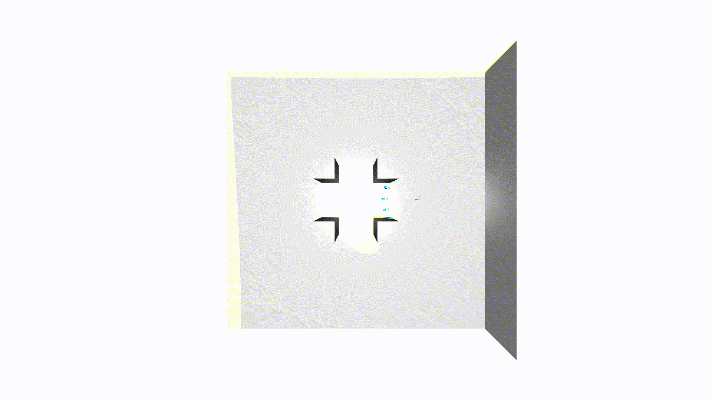
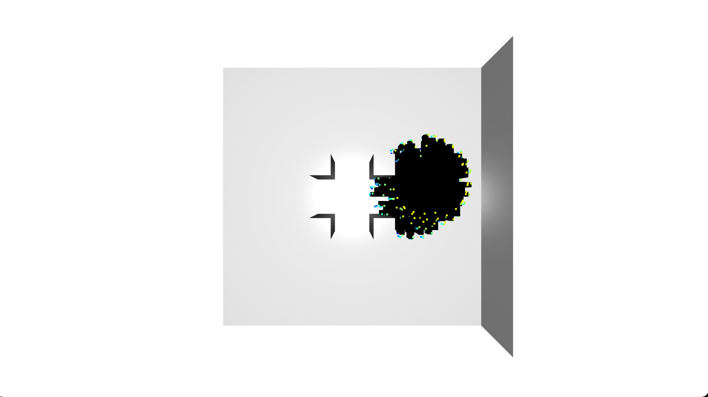
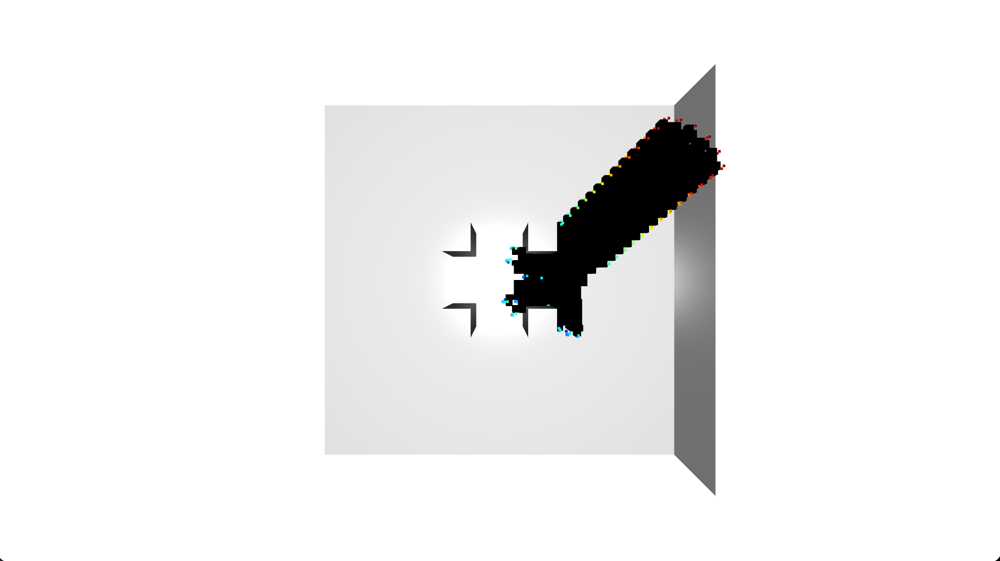

# Exploration

Goals: In this assignment, you will implement an exploration approach.

### Academic Integrity
1. Do not publicly share your solution (using GitHub or otherwise)
2. Collaboration is encouraged but you should write final code on your own.
3. No AI tools may be used to complete this assignment. This includes but is not limited to Copilot, ChatGPT, Perplexity AI, and Cursor AI.

## 0. Setup
Download the assignment.

```
git clone git@github.com:mr-cmu/assignment4-handout.git
cd assignment4-handout
```

Note: if the above command results in a Permission denied (public key)
error, then try setting up an SSH key in your Github account using the
instructions
[here](https://docs.github.com/en/authentication/connecting-to-github-with-ssh/adding-a-new-ssh-key-to-your-github-account).

If the cloning still does not work, use

```
git clone https://github.com/mr-cmu/assignment4-handout.git
```

Copy the `sensor_simulator`, `map_tools`, `visualizer` and `utils` directories from
assignments 0 and 2 into `quadrotor_simulator_py`. This assignment
will refer to some of the classes defined in the prior homework
assignment.
```
cp -r /path/to/assignment0-handout/quadrotor_simulator_py/utils assignment4-handout/quadrotor_simulator_py/
cp -r /path/to/assignment2-handout/quadrotor_simulator_py/visualizer assignment4-handout/quadrotor_simulator_py/
cp -r /path/to/assignment2-handout/quadrotor_simulator_py/map_tools assignment4-handout/quadrotor_simulator_py/
cp -r /path/to/assignment2-handout/quadrotor_simulator_py/sensor_simulator assignment4-handout/quadrotor_simulator_py/
```

Next, you can either use the python environment you used for
assignment 1 or create a new one.

```
python3.8 -m venv .venv
```

Source the environment

```
source .venv/bin/activate
```

You will need to install the following dependencies:

```
pip install numpy matplotlib scikit-learn pyyaml open3d tqdm
```

## 1. Exploration (100 points)
In this part of the homework you will implement an exploration
algorithm that needs to outperform both a random and greedy planner.
Details about the Random Explorer and Greedy Explorer are provided
below.

In order to implement your exploration algorithm, you will need
to populate two functions:

1. `evaluate_view_reward`
2. `get_next_sensing_action`

`evaluate_view_reward` provides a score of how good the view is and
will be used to select the next sensing action.

`get_next_sensing_action` will determine a set of poses on which to
call `evaluate_view_reward`. The best view is returned.

### Random Explorer
The random explorer samples actions in x,y, and z near the current
action. The scoring function in `evaluate_view_reward` is just a
random number generator. As you can see, the actions are just randomly
placed in the environment and don't enable efficient exploration.



Here is a visualization of how much space was explored.


### Greedy Explorer
The greedy explorer samples actions in x,y, and z near the current
action. The scoring function in `evaluate_view_reward` counts the
number of unknown voxels within the view. As you can see, the actions
greedily maximize exploration performance.


Here is a visualization of how much space was explored.


### Student Explorer
You are free to write the `evaluate_view_reward` and
`get_next_sensing_action` functions in whatever way you see fit. To
get full credit on the assignment, you must outperform both the random
and greedy exploration solutions.

## 2. Grading with AutoLab
To have your solutions graded, you will need to tar the `quadrotor_simulator_py`
folder and upload to autolab.

```
tar -cvf handin.tar quadrotor_simulator_py
```

Autolab will run tests on each function you implement and you will
receive a score out of 100.  You may upload as many times as you like.
Note that we may regrade submissions after the deadline passes.
